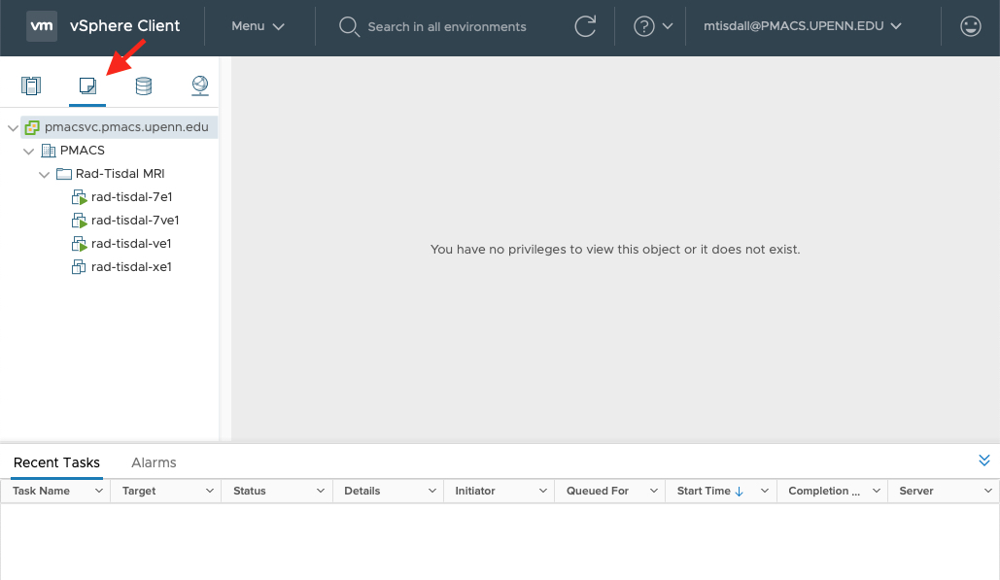
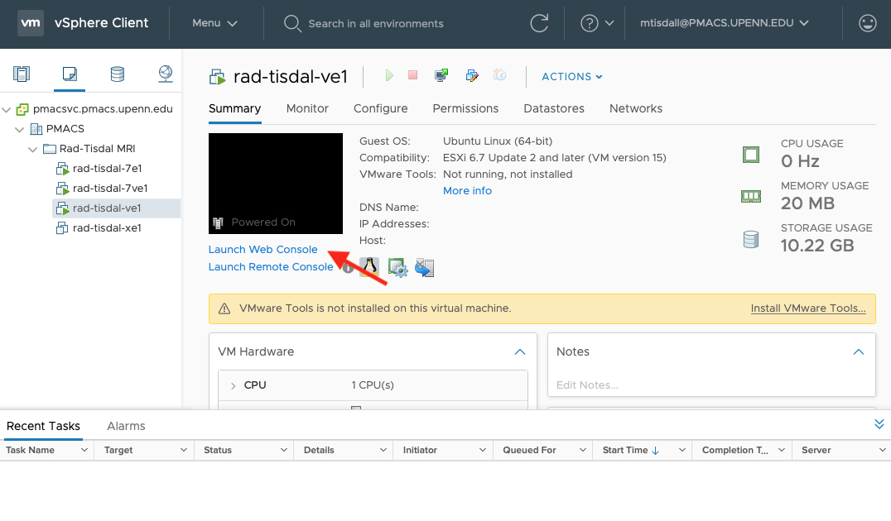
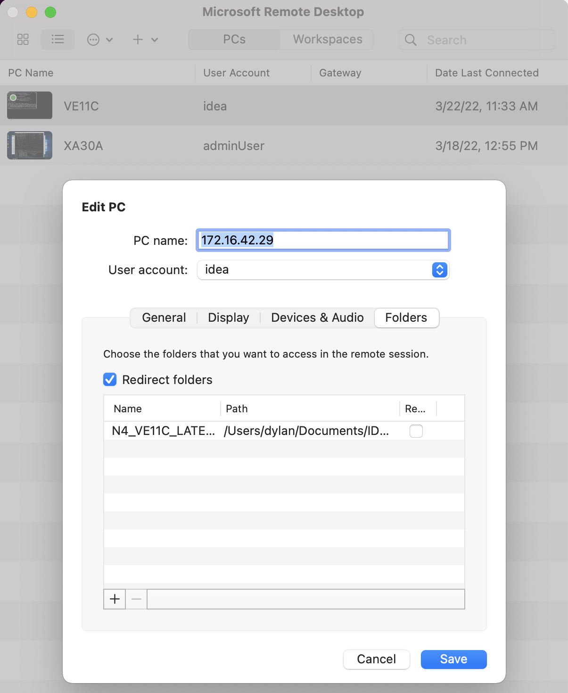

# Using IDEA Virtual Machines

## Overview

The Siemens IDEA environment is being virtualized by PMACS, within their vSphere server environment. For each version of IDEA, you'll need to establish two VMs: one for the Windows environment, and one for the Linux environment. 

## Communicating with PMACS to make requests

Please use the PMACS ticket system [http://helpdesk.pmacs.upenn.edu]([http://helpdesk.pmacs.upenn.edu). In each section below where a ticket might be required, please use the exact ticket template provided. If your ticket seems to be not progressing, let Dylan know and he can contact Jerry at PMACS to help triage.

## Getting an account:

You'll first need a PMACS account (ask Dylan to file a ticket for you). Once you have that, you can enter the ticket system. To create a new user for the vSphere system (the management system for the VMs), file a ticket as follows:

* Ticket Description: New user setup for Robust Methods of Magnetic Resonance (RMMR)
* PennKey:
* Group: VPN-rad-tisdal, Vcenter-rad-tisdall

## Setting up a new virtual machine

### Instantiating the VMs
You'll need to request both the Windows and Linux VMs associated with the version of IDEA you'd like to have setup. For this, you can use a ticket following the template below. **Do Not Just Copy This Template**; make sure to fill in the Template and VM Name lines with your specific information.

* Ticket Description: New VM setup for Robust Methods for Magnetic Resonance (RMMR)
* Windows Operating System: Windows 10 or Windows 7
* Windows Template: *copy from list below*
* Windows VM Name: \<YourFirstName\>_\<IDEAVersion\>_Win
* Linux Template: *copy from list below*
* Linux VM Name: \<YourFirstName\>_\<IDEAVersion\>_MARS
* Add VMs to Folder: Rad-Tisdal MRI
* Place VMs on Network: tisdalvm-172.16.0.0/25
  
Here's a list of the templates associated with each IDEA verson

|IDEA Version	| Windows					| Linux 					|
| ----		| ----						| ----						|
| N4VE11C	| RAD-MRI_VE11C_Distribution_Win7_Template 	|  RAD-MRI_VE11C_linux_win7_20160120_mars	|
| N4VE12U_SP01	| RAD-MRI_VE12U-SP01_Distribution1_Win7_Template|  RAD-MRI_VE12U-SP01_Distribution_linux_Win7_Template	|
| NXVA30A	| RAD-MRI_XA30A_DistributionOVF_win10_Template 	|  RAD-MRI_XA30A_DistributionOVF_linux_win10_Template	|


### Connecting to the VPN

Go to: [https://remote.pmacs.upenn.edu](https://remote.pmacs.upenn.edu) to initiate a connection. If this is your first connection, you will need to install the Pulse Secure App Launcher.

### Connecting to the vSphere

[https://pmacsvc.pmacs.upenn.edu](https://pmacsvc.pmacs.upenn.edu)

List the available VMs by clicking on the VM list option.



Pick the Linux VM for the IDEA version you're instantiating, and then click on `Lauch Web Console`. 



You will see a pop-up, in which you again choose `Launch Web Console` (this may require disabling pop-up blockers). Version-specific instructions follow below.

### Configuring VE11C and VE12U VMs

#### Linux

If you just get a black screen in the web console, tap any key to bring up the Linux login prompt.

Log in as `root`. It will not require a password.

By default, the MARS machine should automatically be configured to use DHCP and get a valid IP address. To confirm this, run `ifconfig` and confirm that there are two active interfaces, one being the loopback (lo) and the other being some ethernet device (name changes with each IDEA version, but should be "en" something or "e" something). If you do not have an active ethernet interface, reach out to Dylan and we can figure out what's misconfigured in the image and make a note of how to fix it here for future users.

You now need to setup a hostname so that your Windows VM can always find this Linux machine. To do this use your favorite editor to create the file `/etc/hostname` and enter the desired hostname for the linux machine. Note this cannot have underscores. I suggest `<your initials><idea version>mars` (e.g., `mdtve11cmars`) as this will avoid collisions while being succinct. One you have created this file, restart the the MARS machine with the `reboot` command.

#### Windows

Using the same steps as above, now open the web console for the Windows version of the machine. 

Log in as user `IDEA` password `idea`

Need to figure out firewall settings. For now, just disable the Windows Firewall.

To configure the machine to use DHCP, go to `Control Panel > Network and Sharing Center` and then click on the ethernet connection icon (likely called "Local Area Connection" followed by a number). Click on "Properties". Select "Internet Protocol Version 4" and then click "Properties". Select "Obtain an IP address automatically" and "Obtain DNS serve address automatically". Accept the changes.

To configure the machine hostname, go to `Control Panel > System` and then click on "Change Settings". On the "Computer Name" tab, click "Change". Enter the desired hostname for the Windows machine. Note this cannot have underscores. I suggest `<your initials><idea version>win` (e.g., `mdtve11cwin`) as this will avoid collisions while being succinct. Accept the change and the system will need to be restarted.

You should now be able to connect to this system via RDP (download Microsoft Remote Desktop or similar client) as `<hostname>.pmacs.upenn.edu`. The username:password for is now `idea:idea`. From here on out, I like to do things via RDP, and not via the web console.

Start IDEA and run `externalmars true`. You'll be prompted for the IP address of the Linux machine (you can get this by running `ifconfig` on the MARS, or by just looking in the vSphere website), which you should enter. You should now be able to build the Linux binaries for a given sequence. In the future, we need to be able to access the mars via its hostname, so edit `C:\MIDEA\MIDEA.cfg` with a text editor. Change the line `ExternalMarsIp=<ip address>` to `ExternalMarsIp=<mars hostname>.pmacs.upenn.edu`. Now IDEA will resolve that hostname to find the IP address whenever it tries to connect to the MARS for linux compilation.

*Optional* On your local system, checkout the branch of the `idea_vmware_tools` repo associated with your IDEA version (e.g., `N4_VE11C_LATEST_20160120`) from the group github -- these are convenience scripts for managing the VM remotely. Make sure you name the directory exactly as per the github branch name (e.g., `N4_VE11C_LATEST_20160120`), as scripts rely on this name (e.g., check this out to `~/IDEA/N4_VE11C_LATEST_20160120`).

Configure your Remote Desktop client to share `~/IDEA/N4_VE11C_LATEST_20160120/` (or wherever you checked out the repos) with the remote system.



On the remote Windows system, enable sharing on `C:\MIDEA` for user IDEA. 

You should now be able to mount `MIDEA` on your local system via SMB (if you've downloaded the idea_vmware_tools, you can use the `mount_midea_share.bash` script, which will mount it into the current directory as `./midea-mnt`).

*Optional* If you have the idea_vmware_tools, once the remote drive is mounted locally, run `config_built_dir.sh` to ensure binaries are copied back to your local machine (you only need to do this once).

*Optional* Put any source packages you have received from Siemens in the `packages` directory and run `install_source.sh`. This can be re-run whenever you get new source packages.

### Configuring XA30A VMs

#### Linux XA30A

If you just get a black screen in the web console, tap any key to bring up the Linux login prompt.

Log in as `root`. It will not require a password.

We need to bring this machine's network connection online at the correct IP address. To do this, run:

```
ifconfig up eth0 <ip>
ifconfig eth0 netmask 255.255.255.0
```

where you should replace `<ip>` with the IP address you were assigned for this machine. If you don't know the IP address, file a ticket to request you get assigned one and add it to the table at the end of this document.

You can then close the web console for the linux system.

Note that if you need to restart the Linux VM for some reason, you'll need to run those two commands again in order to reconnect it to the network.

#### Windows XA30A 

Using the same steps as above, now open the web console for the Windows version of the machine. 

Log in with user `IDEA`, password `idea`

Start IDEA and run `externalmars true -ip <ip>`, replacing `<ip>` with the IP address of the Linux machine, which you should enter. You should now be able to build the Linux binaries for a given sequence -- try it out before proceeding!

Need to figure out firewall settings. For now, just disable the Windows Firewall.

You should now be able to connect to this system via RDP (download Microsoft Remote Desktop or similar client). The username:password for is now `adminUser:idea`. From here on out, I like to do things via RDP, and not via the web console.

On your local system, checkout the `NXVA30A_162141` branch of the `idea_vmware_tools` repos from the group github. Make sure you name the directory `NXVA30A_162141`, as scripts rely on this name (e.g., check this out to `~/IDEA/NXVA30A_162141`).

Configure your Remote Desktop client to share `~/IDEA/NXVA30A_162141/` with the remote system.

On the remote Windows system, enable sharing on `C:\MIDEA` for user IDEA. When asked if you want to update sharing settings for `C:\MIDEA\VirtualBox\` select `Don't change settings`.

You should now be able to mount `MIDEA` on your local system via SMB, using the `mount_midea_share.bash` script, which will mount it into the current directory as `./midea-mnt`. 

Once the remote drive is mounted locally, run `config_built_dir.sh` to ensure binaries are copied back to your local machine (you only need to do this once).

Put any source packages you have received from Siemens in the `packages` directory and run `install_source.sh`. This can be re-run whenever you get new source packages.


## Resetting the virtual machines

If something goes wrong, you can always request PMACS to reset the VM. **THIS WILL ERASE EVERYTHING ON THE MACHINE** so make sure your code is committed and pushed to GitHub. To request a reset, please use the following ticket format:


* Ticket Description: Re-initialize VM for Robust Methods of Magnetic Resonance (RMMR)
* Name of VM(s) to delete
* Windows Operating System: Windows 10 or Windows 7
* Windows Template: *copy from list above* 
* Linux Template: *copy from list above*


## Troubleshooting issues with linux builds

The account that is used to mount the Windows files system on the linux VM is configured to have its password expire intermittently. When this happens, linux builds will fail, reporting that the source files do not exist. The solution to this is to reset the password of the appropriate account.

To find the username and password used by the linux builds, run `ideassh` from the IDEA command prompt. This opens a terminal in the linux command prompt, in which you can type `cat cifs-credentials.txt`. The contents of that file define the username and password that the linux machine to mount the Windows file system.

On the Windows VM, use the User Accounts control panel to find the user named in the linux cifs-credentials.txt file, and update that user's password to match the password given in cifs-credentials.txt. Once you update the password, linux builds should work again.

## Assigned IP addresses

|	| VE11C Linux  | VE11C Win    | VE12U_SP01 Linux | VE12U_SPO1 Win | XA30A Linux  | XA30A Win    |
|-----  | -----        | -----        | ----         | -----        | ----         | -----        |
| Dylan | 172.16.42.30 | 172.16.42.29 |        | 172.16.42.41        | 172.16.42.39 | 172.16.42.28 |
| Shraddha | | | 172.16.42.25        | 172.16.42.24         | 172.16.42.27 | 172.16.42.26 |
